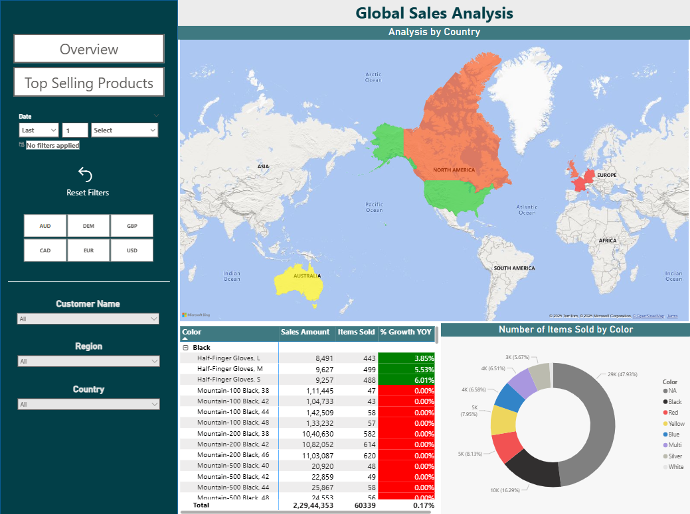
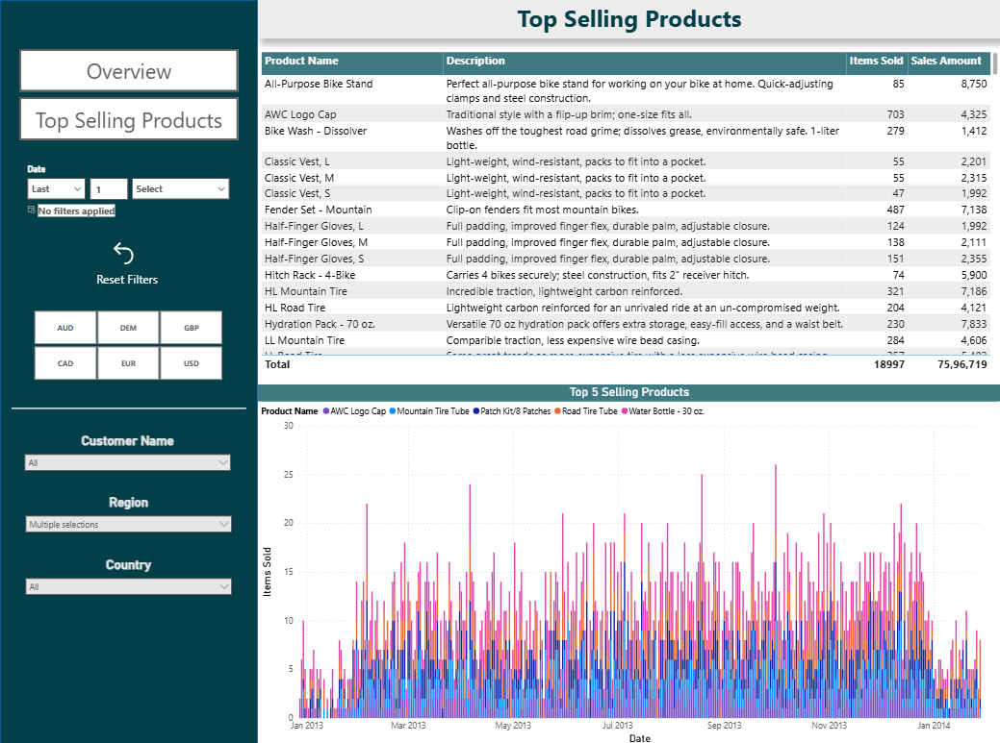

## 📊 Global Sales Analysis Dashboard – Power BI  

🔹 **Project Overview**

This project showcases a **Global Sales Analysis Dashboard** built in Power BI for a marketing company.  
The dashboard provides insights into sales performance across regions, products, and customer segments, enabling **data-driven decision-making**.  

---

🔹 **Key Features**  
- 🌍 **Regional Analysis** – Compare sales across continents, countries, and regions.  
- 📈 **KPI Tracking** – Revenue, YoY Growth, Actual vs Target Sales, top-selling products. 
- 🔄 **ETL & Data Prep** – Cleaned and transformed raw datasets using Power Query.  
- 🗂 **Data Modeling** – Star-schema model for optimized reporting.  
- 🎯 **Advanced Visuals** – Drill-through reports, bookmarks, KPI cards, and slicers.  
- 💡 **Business Insights** – Identified top-performing regions, underperforming products, and top-selling products.

---

## 🔹 Tools & Skills Used  
- **Power BI** (DAX, Data Modeling, Power Query, Dashboard Design)  
- **Excel** (Data Sources) 

---

## 🔹 Dashboard Preview  

---

## 🔹 Repository Contents  
- `Global_Sales_Analysis.pbix` → Power BI dashboard file  
- `data/` → Sample dataset (anonymized)  
- `screenshots/` → Dashboard preview images  
- `README.md` → Project documentation  

---

## 🔹 Author  
👤 **Parth Bhalla**  
🔗 [LinkedIn](https://www.linkedin.com/in/parth-bhalla-a00a56235/) | [Portfolio](https://github.com/BhallaP21)
